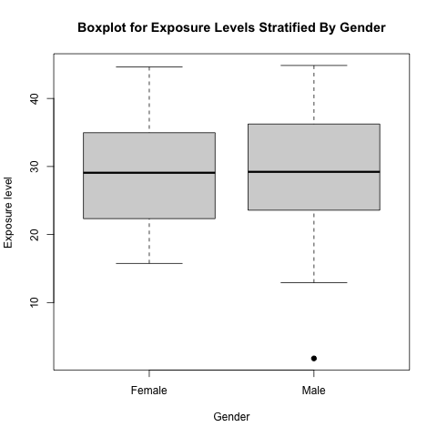

<!--  
   suppresses all code chunks from appearing
-->

```{r, setup, include=FALSE}
knitr::opts_chunk$set(echo=FALSE)
```

### Basic description of the raw dataset

```{r, raw_data}
met_data <- read.table('../raw_data/data.txt', header = T)
```

1. There are __`r nrow(met_data)`__ observations in this dataset.

2. There are __`r ncol(met_data[4:53])`__ metabolic features totally.

3. Boxplot for exposure levels stratified by gender




### Data cleaning

```{r, clean_data}
clean_data <- read.table('../processed_data/clean_data.txt', header = T, sep = ",")
```

1. After removing metabolic features which are not detected in at least 10% of all samples, there are totally __`r ncol(clean_data[8:57])`__ metabolic features.


### Untargeted Metabolome-Wide Association Study (MWAS)

```{r, lm_results}
lm_results <- read.table('../processed_data/lm_results.txt', header = T, sep = ",")

met_005 <- sum(lm_results$`p-value` < 0.05)
met_02 <- sum(lm_results$`p-value` < 0.2)

```
1. Evaluate associations between each metabolic feature and exposure by using linear models

   * There are __`r met_005`__ metabolic features with p-value < 0.05.

   * There are __`r met_02`__ metabolic features with p-value < 0.2.

```{r, res_table}
knitr::kable(lm_results, caption = "Results of untargted Metabolome-Wide Association Study")
```


```{r, system_info}
getwd()
devtools::session_info()
```

